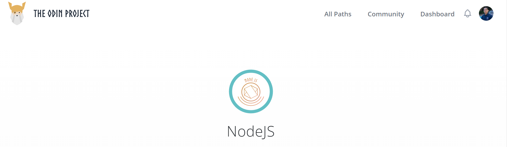

<h1 align="center">
[The Odin Project: Javascript] - List of Completed Projects
</h1>

<!-- AUTO-GENERATED-CONTENT:START (STARTER) -->

  

## Intro

Here you will find all the projects that I completed along with their GitHub Repo for the NodeJS module in the Odin Project.

The course consisted of 17 lessons and 7 projects. Some of the concepts I learned:

-   Setting up a backend with NodeJS and ExpressJS
-   Using MongoDB as my database
-   CRUD & MVC Patterns
-   Setting up authentication using PassportJS
-   How to serve views from the backends using EJS (Embedded JavaScript templating)
-   Creating APIs that serve multiple Frontends 
-   Deploying backend apps using Heroku
-   Unit Testing (Jest)

The projects were more focused on the Backend. I challenged myself to practice my Frontend skills by:
-   Using TypeScript instead of plain JavaScript
-   Setting up TypeScript and Gastby projects
-   SWR Hooks for better API fetchings and mutations
-   Creating my own reusable hooks
-   Using SWR Hooks I no longer needed to depend on parent child components for passing down data. 
-   I learned how efficient a library like SWR Hooks can be over React Context and Redux
-   Dribble (For design inspiration)
-   Gatsby Framework
-   Netlify

## The projects:

1.  [The Odin Project: Node] - Basic Informational Site

    -   [Code](https://github.com/salvillalon45/theOdinProject-BasicInformationalSite)
    -   [Live Site](https://theodinproject-basicinformationalsite.salvadorvillalo.repl.co/index.html)

2.  [The Odin Project: Node] - Mini Message Board

    -   [Code](https://github.com/salvillalon45/theOdinProject-MiniMessageBoard)
    -   [Live Site](https://lit-shelf-92540.herokuapp.com/)

3.  [The Odin Project: Node] - Inventory Application

    -   [Code](https://github.com/salvillalon45/theOdinProject-InventoryApplication)
    -   [Live Site](https://sals-videogamestore.herokuapp.com/)

4.  [The Odin Project: Node] - Members Only

    -   [Code](https://github.com/salvillalon45/theOdinProject-MembersOnly)
    -   [Live Site](https://yeagerists.herokuapp.com/)

5.  [The Odin Project: Node] - Blog API
    - Blog User View
       -   [Code](https://github.com/salvillalon45/theOdinProject-BlogClientUser)
       -   [User View](https://github.com/salvillalon45/theOdinProject-BlogClientUser)
    -  Blog Admin View 
       -   [Code](https://github.com/salvillalon45/theOdinProject-BlogClientAdmin)
       -   [Admin View](https://github.com/salvillalon45/theOdinProject-BlogClientAdmin)
    - Blog API   
    -   [Code](https://github.com/salvillalon45/theOdinProject-BlogApi)

6.  [The Odin Project: Node] - Odin Book
    - Odin Book API
       - [OdinBook API Code](https://github.com/salvillalon45/theOdinProject-OdinBookApi)
    - Odin Book Client
       -   [Code](https://github.com/salvillalon45/theOdinProject-OdinBookClient)
       -   [Live Site](https://odin-book-client-sv.netlify.app/)
